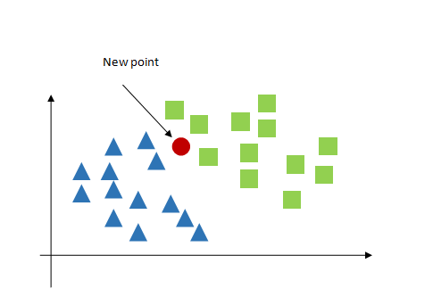
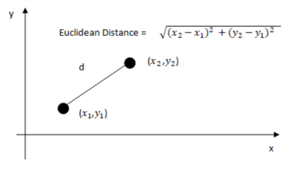
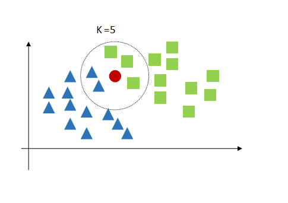
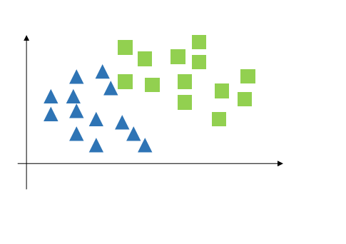
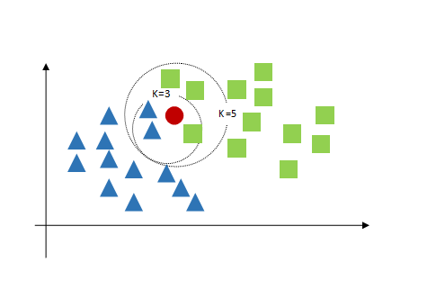
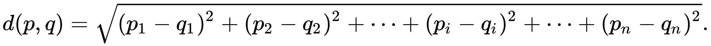

<center><H1>AI Plus OAU Algorithm Challenge<H1></center>
<center></center>


## Project Objective:Build the K-Nearest Neighbours algorithm

## K-Nearest Neighbours theory

k - nearest neighours algorithm is a classification algorithm that group data points based on their proximity to other classes. It goes on in the following steps.

1. It starts with a ready classified data
    
2. a new point to classify is added
    
    
3. based on the proximity measure which is usually euclidean distance 
    
 
,the number of neighbours(K) closest to the new point will be Identified.

4. using K=5 for example we get the nearest 5 data points and make a vote 
    

5. the new point is then classified based on the majority of the class that surrounds it.
    

6. lastly, the value of K is a large determinant of the class of the new point . Here's what happens when k=3.
    

## Code Explaination:
1. I started of by importing the necessary libraries
    ```python
    import numpy as np

    from collections import Counter
    from sklearn import datasets
    from sklearn.model_selection import train_test_split
    ```
    numpy was for handling the arrays that are passed into it from the sklearn datsets library. train_test_split was also imported to give the accuracy of the model

2. imported KNeighborsClassifier to serve as a control
```python
    from sklearn.neighbors import KNeighborsClassifier
```
3. I created the KNN class and created the init method which takes in `n_neighbours` as argument

4. Then created a method `fit` that help get the data.

5. Then created our distance measure `euclidean_distance` from the formular below.
   
   with the help of numpy I was able to compress the complexity

6.  `_predict` helper function was created to give the ability to `predict` to predict the class
    the `_predict` functions first of all calculates the distances of the train data point from the new point
    when is stored in the `distance` variable which is then agregrated with thier indexes intact by the `np.argsort` function. Then first `n_neighbours` will then be taken and with their indexes used to locate their label which is tored in `neighbour_label` variable.The most common of them all will then be stored in the `predicted_values` variable which is then returned by the function.

7. the `predict` function uses the helper class to get the predictions of the data points using list comprehension the returns them as output.

8. the `score` function checks is the predicted class matches the actual test class, then prints result out.


by [Code-victor](https://github.com/Code-Victor)
